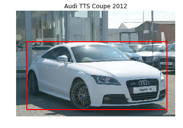
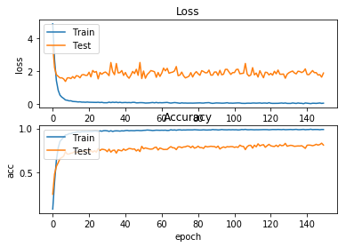

# Grab-Computer-Vision
## Classify car model and make

### Steps: 
1. Download car dataset from Stanford. 
2. Data Exploration.
    - Get the labels.
    - Match labels with index.
    - Import train dataset.
    - Visualize data.
     
    - Take image just only in the bbox to reduce background noise.
     
    - Save the images in folder corresponding to their label.
3. Import Efficientnet B0 image classifier.
4. Split data into train and test dataset.
5. Remove the original classes of Efficientnet and add 196 classes.
6. Set the model to be trainable.
7. Train the model.
8. Visualize result.
     
    - Keras accuracy: 0.793333 
    - Accuracy: 0.008881 
    - Precision: 0.008881 
    - Recall: 0.008929 
    - F1: 0.007560 

### Note 
Accuracy, Precision, Recall, and F1 is generated from predicting images one by one using ScikitLearn library.
These results seems to be contradicted with the accuracy from keras.evaluate_generator.
I will examine this matter in the future.
